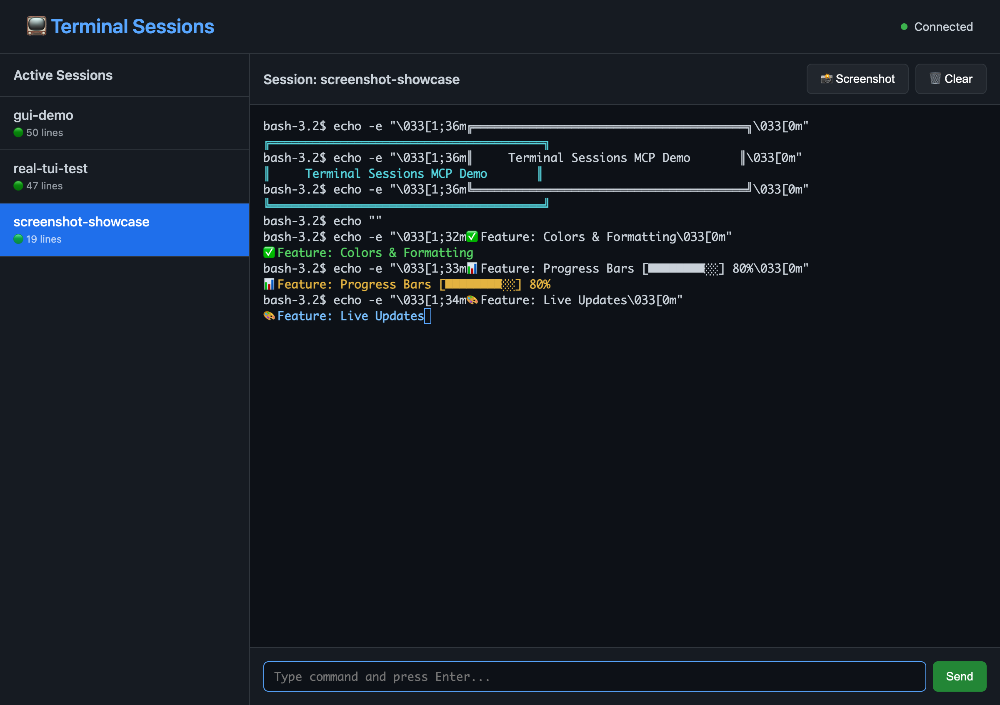
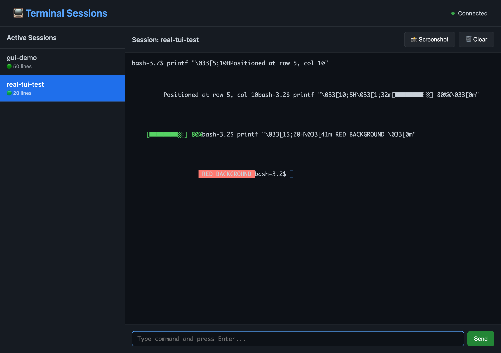

# Terminal Sessions MCP

**Persistent terminal session management with Web GUI and MCP integration for AI assistants**

[](docs/screenshots/web-gui-demo.png)

This package provides a complete solution for managing persistent terminal sessions with intelligent startup detection, log search, **real-time web GUI**, **terminal screenshots**, and seamless integration with AI assistants through the Model Context Protocol (MCP).

## Features

✅ **Web GUI** - Beautiful dashboard to view and interact with all sessions  
✅ **Real TUI Support** - Proper rendering of terminal control sequences with xterm.js  
✅ **Persistent Sessions** - Commands like `cd` and `export` persist across AI responses  
✅ **Smart Service Starting** - Detects when services are ready or have errors  
✅ **Log Search** - Find patterns in output with context  
✅ **Terminal Screenshots** - Capture visually rich terminal output 📸  
✅ **Live Updates** - Real-time streaming via Socket.IO  
✅ **Multi-Service Management** - Track multiple services by name  
✅ **MCP Integration** - Ready for AI assistant integration (Cursor, Claude Desktop, etc.)  
✅ **Interactive Support** - Send input and signals to running processes  

## Quick Start

### 1. Install

```bash
npm install terminal-sessions-mcp
```

### 2. Start the Server (with Web GUI)

```bash
npx session-server
# Opens session server on port 3100
# Opens web GUI on http://localhost:3200
```

**Headless mode (server only, no GUI):**
```bash
npx session-server --headless
# or
HEADLESS=true npx session-server
```

The web GUI provides:
- 📊 Dashboard showing all active sessions
- 🖥️ xterm.js terminal with proper TUI rendering and mouse support
- 🖱️ Full mouse support for TUI apps (mc, htop, etc.)
- 💬 Direct terminal input (type naturally!)
- 📸 Screenshot button to capture terminal state
- 🎨 Beautiful dark theme
- 🔄 Live updates in real-time

### 3. Configure MCP for AI Assistants

Add to your `~/.cursor/mcp.json` or Claude Desktop config:

```json
{
  "mcpServers": {
    "connectome-session": {
      "command": "npx",
      "args": ["ts-node", "/absolute/path/to/terminal-sessions-mcp/src/mcp/mcp-stdio-server.ts"],
      "cwd": "/absolute/path/to/terminal-sessions-mcp",
      "env": {
        "SESSION_SERVER_PORT": "3100"
      }
    }
  }
}
```

**Note:** Replace `/absolute/path/to/` with your actual installation path. The session server must be running on the specified port before the MCP server connects.

## TUI Control Sequences Support

With the web GUI and xterm.js, all terminal control sequences work perfectly:

[](docs/screenshots/tui-controls.png)

- ✅ **Cursor positioning** - `\033[row;colH`
- ✅ **Screen clearing** - `\033[2J\033[H`
- ✅ **Colors & formatting** - All ANSI codes (30-37, 40-47, bold, dim, etc.)
- ✅ **Progress bars** - Dynamic updates with proper positioning
- ✅ **Box drawing** - UTF-8 box characters (╔═══╗)
- ✅ **Live TUIs** - htop, vim, tmux, custom TUI apps

## API Usage

### From TypeScript/JavaScript

```typescript
import { SessionClient } from 'terminal-sessions-mcp';

const client = new SessionClient('ws://localhost:3100');

// Create a session
await client.createSession({ id: 'my-session' });

// Execute commands
const result = await client.exec('my-session', 'npm test');
console.log(result.output);

// Search logs
const matches = await client.searchLogs('my-session', 'error|warning', 5);

// Take a screenshot (includes all colors and formatting!)
const screenshot = await client.takeScreenshot('my-session', {
  lines: 50,
  outputPath: './terminal.png'
});
```

## Architecture

```
┌─────────────────────────────────────────────────┐
│      Web GUI (http://localhost:3200)            │
│  - xterm.js terminal rendering                  │
│  - Live Socket.IO updates                       │
│  - Session dashboard                            │
└─────────────────────────────────────────────────┘
                     ↕ Socket.IO
┌─────────────────────────────────────────────────┐
│    Session Server (ws://localhost:3100)         │
│  - PTY-based persistent sessions                │
│  - WebSocket API                                │
│  - Event streaming                              │
└─────────────────────────────────────────────────┘
                     ↕ MCP Protocol
┌─────────────────────────────────────────────────┐
│       AI Assistant (Cursor, Claude, etc.)       │
│  - 10 MCP tools for session management          │
│  - Start services, run commands                 │
│  - Take screenshots                             │
└─────────────────────────────────────────────────┘
```

## Available Tools (MCP)

Once configured, your AI assistant will have access to these tools:

### Session Management
- **startService** - Start a long-running service with startup detection
- **runCommand** - Execute a command and wait for completion
- **listSessions** - Get all active sessions
- **killSession** - Terminate a specific session (graceful by default)
- **killAll** - Terminate all active sessions

### Interactive Operations
- **sendInput** - Send input to a running process
- **sendSignal** - Send a signal (SIGINT, SIGTERM, etc)

### Log Operations
- **tailLogs** - Get recent logs from a session
- **searchLogs** - Search logs with regex patterns and context
- **takeScreenshot** - Capture terminal screenshot with proper TUI rendering 📸

## CLI Usage

The package includes a CLI tool for manual session management:

```bash
# List sessions
npx session-cli list

# Create a session
npx session-cli create my-session --cwd=/path/to/dir

# Execute a command
npx session-cli exec my-session "npm test"

# Tail logs
npx session-cli tail my-session --lines=100

# Subscribe to live events
npx session-cli subscribe my-session --replay=50
```

## Web GUI Usage

Start the web GUI to visually manage all your terminal sessions:

```bash
# Start on default port (3200)
npx session-gui

# Or custom port
GUI_PORT=8080 npx session-gui
```

Then open http://localhost:3200 in your browser to:
- View all active sessions in a sidebar
- Click any session to see its xterm.js rendered terminal
- Type commands directly in the web interface
- Watch live updates stream in real-time
- Take screenshots from the rendered terminal
- Monitor multiple services simultaneously

## Terminal Screenshots 📸

Perfect for debugging visually rich terminal applications:

```typescript
// Capture a TUI, progress bar, or ANSI art
const result = await client.takeScreenshot('my-session', {
  lines: 50,           // How many lines to capture
  outputPath: './screenshot.png',  // Save to file
  width: 1200,         // Image width
  height: 800          // Image height
});

// Or get base64 (omit outputPath) - displays inline in MCP!
const { base64 } = await client.takeScreenshot('my-session');
```

**Use cases:**
- 📊 Debugging progress bars and spinners
- 🎨 Capturing ANSI art and colors
- 🖥️  Visual regression testing of CLI tools
- 📝 Documenting terminal applications
- 🔍 Sharing colorized logs with proper formatting

## Use Cases

### 1. AI-Assisted Development

Enable AI assistants to manage development services, run tests, and interact with terminal sessions without losing context between responses.

### 2. Multi-Service Testing

Start and monitor multiple services simultaneously, with intelligent startup detection and log search.

### 3. Visual Terminal Debugging

Capture screenshots of TUIs, progress bars, and ANSI art for debugging or documentation. The web GUI provides real-time visual feedback.

### 4. Interactive Debugging

AI assistants can interact with running processes, send input, and observe output in real-time.

### 5. Team Collaboration

Share terminal sessions between multiple agents or humans. Send a URL to view live terminal output.

## Development

```bash
# Clone the repository
git clone https://github.com/anima-labs/terminal-sessions-mcp.git
cd terminal-sessions-mcp

# Install dependencies
npm install

# Build
npm run build

# Start session server
npm run start-server

# Start web GUI
npm run start-gui

# Run CLI
npm run cli -- list

# Run demos
npx ts-node examples/screenshot-demo.ts
npx ts-node examples/service-management.ts
```

## Requirements

- **Node.js** >= 18.0.0
- **Headless Chrome** (via Puppeteer) for screenshots
- **Modern browser** for web GUI (Chrome, Firefox, Safari, Edge)

## Configuration

### Environment Variables

- `SESSION_SERVER_PORT` - WebSocket session server port (default: 3100)
- `GUI_PORT` - Web GUI port (default: 3200)
- `MCP_DEBUG` - Enable debug logging (set to "1")

## Troubleshooting

### MCP server not loading

1. Ensure the session server is running: `npx session-server`
2. Check that paths in mcp.json are absolute
3. Restart your AI assistant after configuration changes
4. Enable debug mode: `MCP_DEBUG=1`

### Web GUI not connecting

1. Ensure session server is running on port 3100
2. Check browser console for errors
3. Verify Socket.IO and xterm.js CDN libraries loaded
4. Try a different port if 3200 is occupied

### Screenshots failing

1. Ensure Puppeteer can launch headless Chrome
2. Check system resources (memory)
3. Try with fewer lines: `lines: 20`

## License

MIT

## Credits

Developed by [Anima Labs](https://github.com/anima-labs) as part of the Connectome project.

Extracted as a standalone package because terminal session management with proper TUI support is universally useful for AI-assisted development workflows.

## Contributing

Contributions welcome! Please open an issue or PR on GitHub.

---

**Star ⭐ this repo if you find it useful!**
