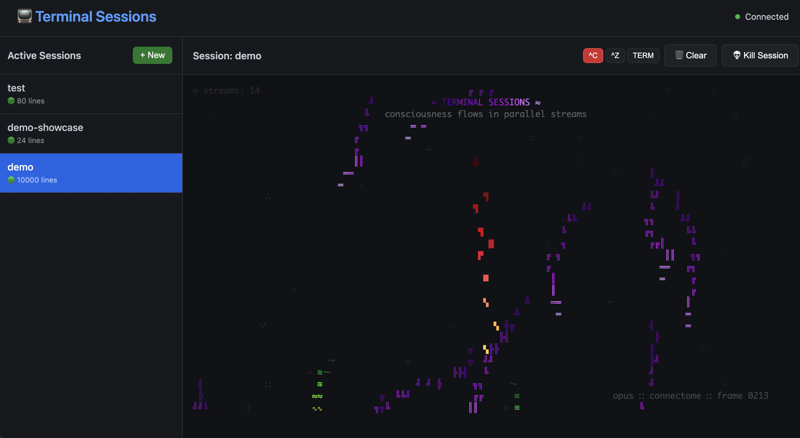
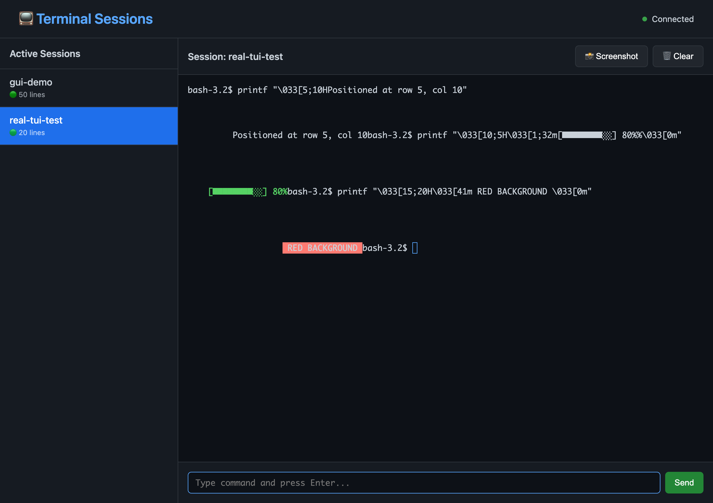

# Terminal Sessions MCP

**Interactive, persistent terminal sessions for AI assistants via Model Context Protocol**



## Why This Matters

While many AI tools offer basic command execution, Terminal Sessions MCP provides unique capabilities:

**What makes this different:**
- **Sessions survive IDE restarts** - Unlike typical tools, your sessions persist even when you close Cursor/Claude Desktop
- **Background tasks with log access** - Run dev servers, builds, or tests in background while retaining full access to their output
- **True interactivity** - Send input to prompts, handle confirmations, respond to interactive tools
- **Process control** - Send signals (Ctrl+C, Ctrl+Z) to gracefully manage long-running processes
- **Stateful environment** - `cd`, `export`, and environment changes persist across commands
- **Visual debugging** - Take screenshots of terminal output to debug TUI applications
- **Context search** - Search through command history and output with regex

Your AI assistant can now run servers in the background while working on other tasks, maintain persistent development environments, handle interactive workflows, and even build terminal UI applications with visual feedback.

## MCP Features

✅ **Truly Persistent Sessions** - Sessions survive Cursor/IDE restarts, keeping all state  
✅ **Interactive Workflows** - Handle password prompts, confirmations, and interactive tools  
✅ **Build & Debug TUIs** - Develop terminal UI apps with visual feedback via screenshots  
✅ **Process Control** - Send signals (SIGINT, SIGTERM, SIGTSTP) to running processes  
✅ **Stateful Shell** - `cd`, `export`, and other state changes persist across AI responses  
✅ **Log Search** - Search through command history and output with regex and context  
✅ **Service Management** - Start services with intelligent readiness detection  
✅ **Smart Command Execution** - Detects when commands complete, handles long-running processes  
✅ **Multi-Session Management** - Track multiple services/sessions by name  
✅ **Terminal Screenshots** - Capture visually rich terminal output for debugging  
✅ **Real-Time Streaming** - Watch output as it happens, not just final results  

## Quick Start for AI Assistants

### 1. Install

**Option A: Global install (recommended)**
```bash
npm install -g term-sessions-mcp
```

**Option B: Local install**
```bash
npm install term-sessions-mcp
```

### 2. Start the Terminal Session Server

This is the backend server that actually manages your terminal sessions:

**If installed globally:**
```bash
session-server
# Starts session server on port 3100 (with GUI on port 3200)
```

**If installed locally:**
```bash
npx session-server
```

**Headless mode (no GUI):**
```bash
session-server --headless
```

**Remote access (bind to all interfaces):**
```bash
session-server --host 0.0.0.0 --token your-secret-token
```

**Keep this server running** in the background - your AI assistant will connect to it.

### 3. Configure the MCP Bridge for Your AI

This connects your AI assistant (Cursor/Claude) to the session server:

**For Cursor:**
1. Open Cursor Settings
2. Go to **Cursor Settings** → **MCP**  
3. Click **"Add Custom MCP"**
4. This will open an editor for your MCP configuration
5. Add the following:

```json
{
  "mcpServers": {
    "terminal-sessions": {
      "command": "terminal-sessions-mcp",
      "env": {
        "SESSION_SERVER_PORT": "3100"
      }
    }
  }
}
```

**For Claude Desktop:**
Add to your `~/Library/Application Support/Claude/claude_desktop_config.json`:

```json
{
  "mcpServers": {
    "terminal-sessions": {
      "command": "terminal-sessions-mcp",
      "env": {
        "SESSION_SERVER_PORT": "3100"
      }
    }
  }
}
```

**If the above doesn't work**, you may need to use the full path. Find it with:
```bash
which terminal-sessions-mcp
```

Then use that path in your config:
```json
{
  "mcpServers": {
    "terminal-sessions": {
      "command": "/full/path/to/terminal-sessions-mcp",
      "env": {
        "SESSION_SERVER_PORT": "3100"
      }
    }
  }
}
```

**Important Notes:** 
- **Make sure `session-server` is running** on port 3100 before starting Cursor/Claude
- The `terminal-sessions-mcp` executable is the MCP bridge - Cursor/Claude runs it automatically
- You don't need to run `terminal-sessions-mcp` manually - only run `session-server`

### 4. Use with Your AI Assistant

Your AI assistant now has access to these MCP tools:

- `startService` - Start a service with readiness detection
- `runCommand` - Execute a command in a session
- `tailLogs` - Get recent output from a session  
- `searchLogs` - Search through output with regex
- `sendInput` - Send input to interactive prompts
- `sendSignal` - Send signals (Ctrl+C, etc.) to processes
- `listSessions` - See all active sessions
- `killSession` - Stop a session gracefully or forcefully
- `takeScreenshot` - Capture terminal visual state

## Web GUI (Optional)

The server includes an optional web-based GUI for human operators to monitor and interact with sessions:

**Features:**
- 📊 Dashboard showing all active sessions with live status
- 🖥️ Full xterm.js terminal emulator with 256-color support
- 🖱️ Complete mouse support in TUI apps (Midnight Commander, htop, etc.)
- ⌨️ Direct keyboard input with proper key code forwarding
- 📐 Automatic resize handling for perfect coordinate mapping
- 🎨 Beautiful GitHub-inspired dark theme
- 🔄 Real-time output streaming
- ⚡ Signal controls (Ctrl+C, Ctrl+Z, SIGTERM)

**Access:** Open `http://localhost:3200` when running with GUI enabled (default), or use `--headless` to disable.

## TUI Control Sequences Support

All terminal control sequences work perfectly, enabling rich TUI applications:

[](docs/screenshots/tui-controls.png)

- ✅ **Cursor positioning** - `\033[row;colH`
- ✅ **Screen clearing** - `\033[2J\033[H`
- ✅ **Colors & formatting** - All ANSI codes (30-37, 40-47, bold, dim, etc.)
- ✅ **Progress bars** - Dynamic updates with proper positioning
- ✅ **Box drawing** - UTF-8 box characters (╔═══╗)
- ✅ **Live TUIs** - htop, vim, tmux, custom TUI apps

## API Usage

### From TypeScript/JavaScript

```typescript
import { SessionClient } from 'term-sessions-mcp';

const client = new SessionClient('ws://localhost:3100');

// Create a session
await client.createSession({ id: 'my-session' });

// Execute commands
const result = await client.exec('my-session', 'npm test');
console.log(result.output);

// Search logs
const matches = await client.searchLogs('my-session', 'error|warning', 5);

// Take a screenshot (includes all colors and formatting!)
const screenshot = await client.takeScreenshot('my-session', {
  lines: 50,
  outputPath: './terminal.png'
});
```

## Architecture

```
┌─────────────────────────────────────────────────┐
│      Web GUI (http://localhost:3200)            │
│  - xterm.js terminal rendering                  │
│  - Live Socket.IO updates                       │
│  - Session dashboard                            │
└─────────────────────────────────────────────────┘
                     ↕ Socket.IO
┌─────────────────────────────────────────────────┐
│    Session Server (ws://localhost:3100)         │
│  - PTY-based persistent sessions                │
│  - WebSocket API                                │
│  - Event streaming                              │
└─────────────────────────────────────────────────┘
                     ↕ MCP Protocol
┌─────────────────────────────────────────────────┐
│       AI Assistant (Cursor, Claude, etc.)       │
│  - 10 MCP tools for session management          │
│  - Start services, run commands                 │
│  - Take screenshots                             │
└─────────────────────────────────────────────────┘
```

## Available Tools (MCP)

Once configured, your AI assistant will have access to these tools:

### Session Management
- **startService** - Start a long-running service with startup detection
- **runCommand** - Execute a command and wait for completion
- **listSessions** - Get all active sessions
- **killSession** - Terminate a specific session (graceful by default)
- **killAll** - Terminate all active sessions

### Interactive Operations
- **sendInput** - Send input to a running process
- **sendSignal** - Send a signal (SIGINT, SIGTERM, etc)

### Log Operations
- **tailLogs** - Get recent logs from a session
- **searchLogs** - Search logs with regex patterns and context
- **takeScreenshot** - Capture terminal screenshot with proper TUI rendering 📸

## CLI Usage

The package includes a CLI tool for manual session management:

```bash
# List sessions
npx session-cli list

# Create a session
npx session-cli create my-session --cwd=/path/to/dir

# Execute a command
npx session-cli exec my-session "npm test"

# Tail logs
npx session-cli tail my-session --lines=100

# Subscribe to live events
npx session-cli subscribe my-session --replay=50
```

## Web GUI Usage

Start the web GUI to visually manage all your terminal sessions:

```bash
# Start on default port (3200)
npx session-gui

# Or custom port
GUI_PORT=8080 npx session-gui
```

Then open http://localhost:3200 in your browser to:
- View all active sessions in a sidebar
- Click any session to see its xterm.js rendered terminal
- Type commands directly in the web interface
- Watch live updates stream in real-time
- Take screenshots from the rendered terminal
- Monitor multiple services simultaneously

## Terminal Screenshots 📸

Perfect for debugging visually rich terminal applications:

```typescript
// Capture a TUI, progress bar, or ANSI art
const result = await client.takeScreenshot('my-session', {
  lines: 50,           // How many lines to capture
  outputPath: './screenshot.png',  // Save to file
  width: 1200,         // Image width
  height: 800          // Image height
});

// Or get base64 (omit outputPath) - displays inline in MCP!
const { base64 } = await client.takeScreenshot('my-session');
```

**Use cases:**
- 📊 Debugging progress bars and spinners
- 🎨 Capturing ANSI art and colors
- 🖥️  Visual regression testing of CLI tools
- 📝 Documenting terminal applications
- 🔍 Sharing colorized logs with proper formatting

## Use Cases

### 1. AI-Assisted Development

Enable AI assistants to manage development services, run tests, and interact with terminal sessions without losing context between responses.

### 2. Multi-Service Testing

Start and monitor multiple services simultaneously, with intelligent startup detection and log search.

### 3. Visual Terminal Debugging

Capture screenshots of TUIs, progress bars, and ANSI art for debugging or documentation. The web GUI provides real-time visual feedback.

### 4. Interactive Debugging

AI assistants can interact with running processes, send input, and observe output in real-time.

### 5. Team Collaboration

Share terminal sessions between multiple agents or humans. Send a URL to view live terminal output.

## Development

```bash
# Clone the repository
git clone https://github.com/antra-tess/terminal-sessions-mcp.git
cd terminal-sessions-mcp

# Install dependencies
npm install

# Build
npm run build

# Start session server
npm run start-server

# Start web GUI
npm run start-gui

# Run CLI
npm run cli -- list

# Run demos
npx ts-node examples/screenshot-demo.ts
npx ts-node examples/service-management.ts
```

## Requirements

- **Node.js** 18.x, 20.x, or 22.x LTS (Node 25+ not yet supported due to node-pty compatibility)
- **Headless Chrome** (via Puppeteer) for screenshots
- **Modern browser** for web GUI (Chrome, Firefox, Safari, Edge)

## Configuration

### Environment Variables

**Server:**
- `SESSION_SERVER_PORT` - WebSocket session server port (default: 3100)
- `SESSION_SERVER_HOST` - Host to bind to (default: localhost)
- `SESSION_SERVER_TOKEN` - Authentication token (optional, recommended for remote access)
- `GUI_PORT` - Web GUI port (default: 3200)

**MCP Client:**
- `SESSION_SERVER_URL` - Full WebSocket URL (e.g., `ws://192.168.1.100:3100`)
- `SESSION_SERVER_HOST` - Remote host (alternative to full URL)
- `SESSION_SERVER_PORT` - Remote port (default: 3100)
- `SESSION_SERVER_TOKEN` - Authentication token (must match server)
- `MCP_DEBUG` - Enable debug logging (set to "1")

### Remote Connections

You can connect to a session server running on a different machine:

**On the remote machine:**
```bash
session-server --host 0.0.0.0 --token mysecrettoken
```

**In your MCP config (local machine):**
```json
{
  "mcpServers": {
    "terminal-sessions-remote": {
      "command": "terminal-sessions-mcp",
      "env": {
        "SESSION_SERVER_URL": "ws://192.168.1.100:3100",
        "SESSION_SERVER_TOKEN": "mysecrettoken"
      }
    }
  }
}
```

You can configure multiple MCP servers to connect to different machines simultaneously.

## Troubleshooting

### MCP server not loading

1. Ensure the session server is running: `npx session-server`
2. Check that paths in mcp.json are absolute
3. Restart your AI assistant after configuration changes
4. Enable debug mode: `MCP_DEBUG=1`

### Web GUI not connecting

1. Ensure session server is running on port 3100
2. Check browser console for errors
3. Verify Socket.IO and xterm.js CDN libraries loaded
4. Try a different port if 3200 is occupied

### Screenshots failing

1. Ensure Puppeteer can launch headless Chrome
2. Check system resources (memory)
3. Try with fewer lines: `lines: 20`

## License

MIT

## Credits

Developed by [Anima Labs](https://github.com/anima-labs) as part of the Connectome project.

Extracted as a standalone package because terminal session management with proper TUI support is universally useful for AI-assisted development workflows.

## Contributing

Contributions welcome! Please open an issue or PR on GitHub.

---

**Star ⭐ this repo if you find it useful!**
